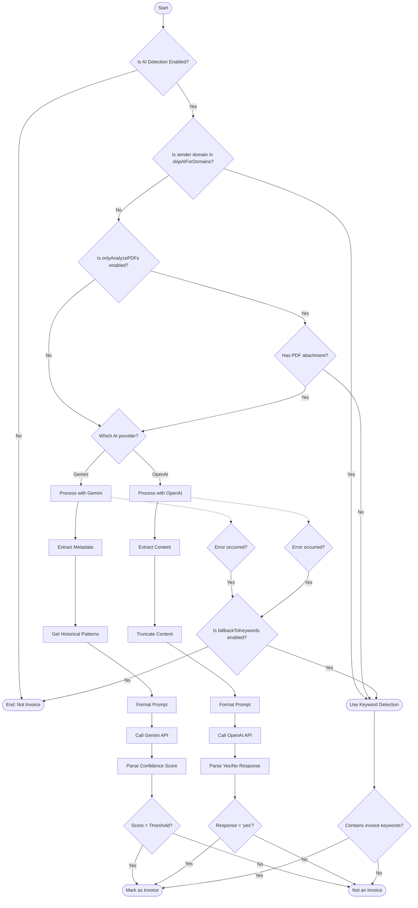

# Filtering Logic: Gmail Attachment Organizer

This document explains the detailed logic used by the Gmail Attachment Organizer to determine which attachments to save and how to identify invoices.

## Table of Contents

- [Filtering Logic: Gmail Attachment Organizer](#filtering-logic-gmail-attachment-organizer)
  - [Table of Contents](#table-of-contents)
  - [Attachment Filtering Logic](#attachment-filtering-logic)
    - [Attachment Decision Flow](#attachment-decision-flow)
    - [Attachment Filtering Criteria](#attachment-filtering-criteria)
  - [Invoice Detection Logic](#invoice-detection-logic)
    - [Invoice Detection Decision Flow](#invoice-detection-decision-flow)
    - [Gemini Implementation (Recommended)](#gemini-implementation-recommended)
    - [OpenAI Implementation (Legacy)](#openai-implementation-legacy)
    - [Fallback Mechanism](#fallback-mechanism)
  - [Configuration Options](#configuration-options)

## Attachment Filtering Logic

The Gmail Attachment Organizer uses a sophisticated multi-tiered approach to determine which email attachments should be saved and which should be filtered out. This helps avoid cluttering your Google Drive with embedded images, email signatures, and other non-essential content.

### Attachment Decision Flow

The following diagram illustrates the decision flow for determining whether to save an attachment:

```mermaid
flowchart TD
    Start([Start]) --> CheckMIME{Is MIME type in whitelist?}

    %% First branch - MIME type whitelist
    CheckMIME -->|Yes| Save1([Save Attachment])

    %% Second branch - Inline image check
    CheckMIME -->|No| CheckInline{Is it an inline image?}
    CheckInline -->|Yes| Skip1([Skip Attachment])

    %% Third branch - Embedded URL check
    CheckInline -->|No| CheckURL{Is it an embedded image URL?}
    CheckURL -->|Yes| Skip2([Skip Attachment])

    %% Fourth branch - Pattern matching
    CheckURL -->|No| CheckPattern{Matches embedded image pattern?}
    CheckPattern -->|Yes| Skip3([Skip Attachment])

    %% Fifth branch - Extension analysis
    CheckPattern -->|No| CheckExtension{What file extension?}

    %% Document types
    CheckExtension -->|Document type| DocType[".pdf, .doc, etc."]
    DocType --> Save2([Save Attachment])

    %% Skipped types
    CheckExtension -->|Skipped type| SkipType[".ics, .vcf, etc."]
    SkipType --> Skip4([Skip Attachment])

    %% Image types
    CheckExtension -->|Image type| CheckImageSize{Image size < threshold?}
    CheckImageSize -->|Yes| Skip5([Skip Attachment])
    CheckImageSize -->|No| Save3([Save Attachment])

    %% No extension (hardcoded value, not in CONFIG)
    CheckExtension -->|No extension| CheckNoExtSize{Size < 50KB? (hardcoded)}
    CheckNoExtSize -->|Yes| Skip6([Skip Attachment])
    CheckNoExtSize -->|No| Save4([Save Attachment])
```

### Attachment Filtering Criteria

The filtering process applies the following criteria in sequence:

1. **MIME Type Whitelist Check**
   - If the attachment's MIME type is in the `attachmentTypesWhitelist` (e.g., PDF, Word, Excel), it is always saved.
   - This ensures important document types are never filtered out.

2. **Inline Image Detection**
   - Checks the `Content-Disposition` header for "inline" designation.
   - Inline images are typically embedded in the email body rather than being true attachments.

3. **Embedded URL Detection**
   - Identifies images referenced by URLs in HTML emails from various providers.
   - Detects patterns like Gmail embedded image URLs with parameters such as `view=fimg` or `disp=emb`.
   - Recognizes Outlook, Yahoo Mail, and other common email image URL patterns.

4. **Pattern Matching**
   - Checks against common patterns for embedded images:
     - `image001.png`, `image002.png`, etc. (common in Outlook)
     - Files starting with `inline-` or `Outlook-`
     - UUID-style names often used for embedded content
     - Common embedded element names (logos, icons, banners, etc.)

5. **File Extension Analysis**
   - Document extensions (`.pdf`, `.doc`, `.docx`, etc.) are always kept.
   - Configured file types to skip (e.g., `.ics`, `.vcf`) are filtered out.
   - Small images (based on `smallImageMaxSize` threshold) are filtered if `skipSmallImages` is enabled.
   - Files without extensions under 50KB are likely embedded content and are filtered out.

## Invoice Detection Logic

The system uses AI to identify invoices with high accuracy, supporting both Gemini (recommended) and OpenAI implementations.

### Invoice Detection Decision Flow



### Gemini Implementation (Recommended)

The Gemini implementation follows a privacy-focused approach:

1. **Metadata Extraction**
   - Extracts only necessary metadata from emails:
     - Subject line
     - Sender domain (not the full email address)
     - Attachment types
     - Keywords found in the email (without sending the full body)
     - Historical patterns (if enabled)

2. **Prompt Formatting**
   - Formats the metadata into a structured prompt for Gemini
   - Includes historical context if available

3. **API Call**
   - Sends the prompt to the Gemini API
   - Receives a confidence score between 0.0 and 1.0

4. **Confidence Evaluation**
   - Compares the confidence score with the configured threshold (`aiConfidenceThreshold`)
   - Marks as invoice if the score exceeds the threshold

### OpenAI Implementation (Legacy)

The OpenAI implementation uses a different approach:

1. **Content Extraction**
   - Extracts subject and body content
   - Truncates long content to minimize data exposure (up to 1500 characters)

2. **Prompt Formatting**
   - Formats a prompt with clear instructions
   - Includes historical context if available

3. **API Call**
   - Sends the prompt to the OpenAI API
   - Requests a yes/no response

4. **Response Parsing**
   - Parses the response to check for "yes"
   - Marks as invoice if the response contains "yes"

### Fallback Mechanism

If AI detection fails or is unavailable, the system can fall back to keyword detection:

1. **Keyword Check**
   - Searches the subject and body for invoice-related keywords
   - Keywords are defined in `CONFIG.invoiceKeywords` (e.g., "invoice", "factura", "receipt")

2. **Domain Exclusion**
   - Specific domains can be excluded from AI analysis using `skipAIForDomains`
   - These will use keyword detection instead

3. **PDF-Only Option**
   - When `onlyAnalyzePDFs` is enabled, only emails with PDF attachments are sent to AI
   - This reduces unnecessary API calls and improves privacy

## Configuration Options

The filtering logic can be customized through various configuration options:

- `attachmentTypesWhitelist`: MIME types that should always be saved
- `skipFileTypes`: File extensions to skip
- `skipSmallImages`: Whether to skip small images
- `smallImageExtensions`: File extensions to consider as images
- `smallImageMaxSize`: Size threshold for small images
- `invoiceDetection`: AI provider to use ("gemini", "openai", or false to disable)
- `skipAIForDomains`: Domains to exclude from AI analysis
- `onlyAnalyzePDFs`: Only process emails with PDF attachments for AI
- `strictPdfCheck`: Check both file extension and MIME type for PDFs
- `fallbackToKeywords`: Fall back to keyword detection if AI fails
- `aiConfidenceThreshold`: Confidence threshold for AI detection (0.0-1.0)
