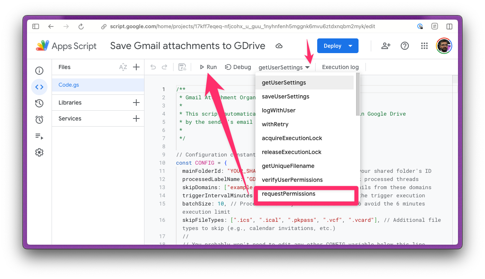
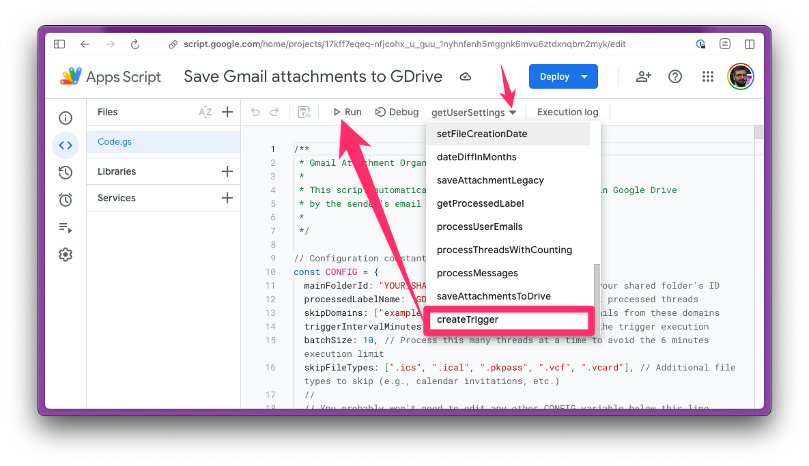
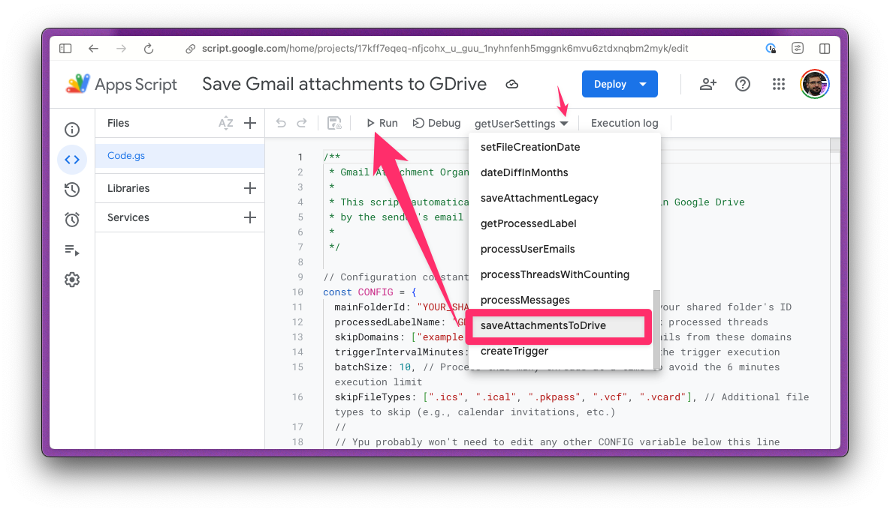

# Installation Guide for Single-File Script

This guide provides detailed instructions for installing and running the single-file script. It is designed for non-technical users, so each step is explained in detail. Please follow these steps carefully to ensure a successful installation.

## Prerequisites

- A Google account with access to Google Drive and Gmail.
- Basic familiarity with Google Apps Script.

## Getting Your Google Drive Folder ID

To configure the script, you need the ID of the Google Drive folder where attachments will be saved. Follow these steps to find your folder ID:

- **Open Google Drive:**
  - Go to [Google Drive](https://drive.google.com/) and log in with your Google account.

- **Navigate to Your Folder:**
  - Locate the folder you want to use for saving attachments.

- **Copy the Folder ID:**
  - Click on the folder to open it.
  - Look at the URL in your browser's address bar. It will look something like this: `https://drive.google.com/drive/folders/1A2B3C4D5E6F7G8H9I0J`
  - The folder ID is the long string of letters and numbers after `folders/`. In this example, the folder ID is `1A2B3C4D5E6F7G8H9I0J`.
  - Copy this ID for use in the script configuration.

## Installing the script

- **Access Google Apps Script:**
  - Open your web browser and navigate to [Google Apps Script](https://script.google.com/).
  - Ensure you are logged in with your Google account.

- **Create a New Project:**
  - Click on the "New Project" button to create a new Google Apps Script project.
  - This will open a new script editor window.

- **Copy the Script:**
  - Open the `Code.gs` file from the `single-file` directory on your local machine.
  - Copy the entire content of the `Code.gs` file.

- **Paste the Script:**
  - In the Google Apps Script editor, select the default `Code.gs` file.
  - Delete any existing content in the editor (including the empty `myFunction` function).
  - Paste the copied script content into the editor.

- **Configure the Script:**
  - Locate the `CONFIG` object at the top of the script.
  - Replace the value `"YOUR_SHARED_FOLDER_ID"` of `mainFolderId` with the ID of your shared Google Drive folder.
  - Below are explanations for the main configuration variables you may need to adjust:
    - `processedLabelName`: The label applied to Gmail threads that have been processed. You can change this to any label name you prefer.
    - `batchSize`: The number of email threads to process in each batch. Adjust this to control the load on your Gmail and Drive services.
    - `skipDomains`: A list of email domains to skip when processing attachments. Add any domains you want to exclude.
    - `triggerIntervalMinutes`: The interval (in minutes) for the trigger execution.
    - `skipFileTypes`: A list of additional file types to skip, such as calendar invitations.
  - Adjust any other configuration settings as needed based on your preferences and requirements.
    - `maxFileSize`: The maximum file size (in bytes) for attachments to be processed. Files larger than this size will be skipped.
    - `skipSmallImages`: A boolean value to determine whether small images (like email signatures) should be skipped.
    - `smallImageMaxSize`: The maximum size (in bytes) for images to be considered small and skipped.
    - `smallImageExtensions`: A list of image file extensions to check when skipping small images.
    - `executionLockTime`: The maximum time (in minutes) to wait for a lock release when preventing concurrent script executions.
    - `maxRetries`: The maximum number of retries for operations that encounter errors.
    - `retryDelay`: The initial delay (in milliseconds) for retries.
    - `maxRetryDelay`: The maximum delay (in milliseconds) for exponential backoff during retries.
    - `useEmailTimestamps`: A boolean value to determine whether to use email timestamps as file creation dates.

- **Save the Project:**
  - Click on the "File" menu and select "Save" to save your project.
  - Give your project a meaningful name, such as "Gmail Attachment Organizer".

- **Authorize the Script:**
  - Click on the "Run" menu and select "requestPermissions".
  - Follow the on-screen instructions to authorize the script to access your Gmail and Google Drive.

- **Set Up Triggers:**
  - The script includes a `createTrigger` function that automatically sets up a time-based trigger.
  - This trigger will run the `saveAttachmentsToDrive` function at the interval specified by the `triggerIntervalMinutes` configuration variable.
  - To create the trigger, run the `createTrigger` function from the "Run" menu in the Google Apps Script editor.
  - Also, ypu can click on the clock icon in the toolbar to open the triggers menu, and set up a time-based trigger to run the `saveAttachmentsToDrive` function at your desired interval.

- **Run the Script:**
  - Click on the "Run" menu and select "saveAttachmentsToDrive" to manually run the script.
  - Check the logs for any errors or messages.

## Additional Notes

- If you encounter any issues, refer to the logs for detailed error messages.

⸻

TIP: If your Gmail account has a large history of emails with attachments, the script may take several iterations to process everything. You can:

- Manually run the `saveAttachmentsToDrive` function a few times to speed up the initial processing.
- Reduce the time interval between triggers (edit the variable `triggerIntervalMinutes`) for more frequent execution.
- Increase the value of the variable `batchSize`, but keep in mind this may lead to timeouts if processing takes too long.

Let the script work at its own pace, and it will catch up eventually!
