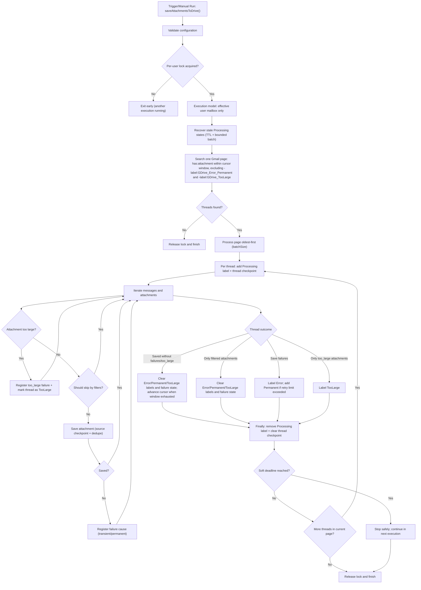

# Gmail Attachment Organizer for Google Drive <!-- omit in toc -->

This Google Apps Script automatically saves Gmail attachments to Google Drive, organizing them by the sender's email domain. This makes it easy to track and manage attachments based on their source.

- [Simple Installation (Recommended)](#simple-installation-recommended)
- [Other Installation Options](#other-installation-options)
  - [Pre-configured Installation (Build Version)](#pre-configured-installation-build-version)
  - [Modular Installation (Multiple Files)](#modular-installation-multiple-files)
    - [Option 1: Manual Installation](#option-1-manual-installation)
    - [Option 2: Using Clasp (Recommended for Developers)](#option-2-using-clasp-recommended-for-developers)
- [Features](#features)
- [Execution Flow](#execution-flow)
  - [High-Level Overview](#high-level-overview)
  - [Flow Diagram](#flow-diagram)
  - [Detailed Breakdown](#detailed-breakdown)
- [Attachment Filtering System](#attachment-filtering-system)
- [Required Permissions](#required-permissions)
- [Execution Model and Users](#execution-model-and-users)
- [Configuration Options](#configuration-options)
- [Thread Processing and Cursor System](#thread-processing-and-cursor-system)
- [Advanced Usage](#advanced-usage)
  - [Custom Processing Options](#custom-processing-options)
- [Performance Considerations](#performance-considerations)
- [Customizing Attachment Filtering](#customizing-attachment-filtering)
- [File Structure](#file-structure)
- [Troubleshooting](#troubleshooting)
- [Available Commands](#available-commands)
- [License](#license)

**Key Features:**

- Domain-based folder organization
- Smart attachment filtering
- Batch processing and duplicate prevention
- Shared-drive friendly, per-user independent execution
- Email date preservation

## Simple Installation (Recommended)

This is the quickest way to get the script running.

**Purpose:**

- Quick and easy setup for most users.

**Steps:**

1. Create a new project in Google Apps Script at \[script.google.com](<https://script.google.com>)
2. Copy the content from the `single-file/Code.gs` file and paste it into the editor.
3. Replace `__FOLDER_ID__` with your Google Drive folder ID.
4. Save and run the `saveAttachmentsToDrive` function.

**Ideal for:**

- Users who want a fast setup without managing multiple files.

**For detailed steps, refer to the \[Installation Steps](./INSTALLATION_STEPS.md).**

## Other Installation Options

- **Pre-configured Installation (Build Version):** Ideal for development or deploying to multiple environments. See details below.
- **Modular Installation (Multiple Files):** Recommended for long-term maintenance and complex projects. See details below.

### Pre-configured Installation (Build Version)

**Purpose:**

- Installation with environment-specific configuration pre-configured.
- Support for separate production and test environments.

**Steps:**

1. Set up environment-specific configuration files:
   - Create `.env.prod` for production environment (see `.env.example`). **This file is mandatory** as production is the default environment.
   - Optionally create `.env.test` for test environment (see `.env.example`).
   - Include `FOLDER_ID` and `SCRIPT_ID` in each file.

2. Run `npm install` to install dependencies.

3. Build and deploy for a specific environment:
   - Production (default environment):

     ```bash
     npm run build:prod    # Generate production build
     npm run deploy:prod   # Deploy to production
     npm run build         # Same as build:prod
     npm run deploy        # Same as deploy:prod
     ```

   - Test:

     ```bash
     npm run build:test    # Generate test build
     npm run deploy:test   # Deploy to test
     ```

4. Run `npm run open` to open the script in the Google Apps Script editor.

**Environment Configuration:**

Each environment can have its own:

- Google Drive folder (via `FOLDER_ID`)
- Google Apps Script project (via `SCRIPT_ID`)

**Ideal for:**

- Development and deployment to multiple environments.
- Testing new features without affecting production.
- Maintaining separate configurations for different use cases.

### Modular Installation (Multiple Files)

**Purpose:**

- Organized file structure for long-term maintenance.

#### Option 1: Manual Installation

1. Create a new project in Google Apps Script at \[script.google.com](<https://script.google.com>)
2. Create the following files in your project:
    - `Config.gs`
    - `Utils.gs`
    - `UserManagement.gs`
    - `AttachmentFilters.gs`
    - `FolderManagement.gs`
    - `AttachmentProcessing.gs`
    - `GmailProcessing.gs`
    - `LabelManagement.gs`
    - `ThreadState.gs`
    - `Main.gs`
    - `Debug.gs` (optional)
    - `appsscript.json`
3. Copy the content of each file from the `src/` directory.
4. Update the `mainFolderId` in `Config.gs` with your Google Drive folder ID.
5. Save and run the `saveAttachmentsToDrive` function.

#### Option 2: Using Clasp (Recommended for Developers)

[Clasp](https://github.com/google/clasp) is Google's Command Line Apps Script Projects tool, which makes it easier to develop and manage Apps Script projects.

1. Install Clasp globally (requires Node.js):

   ```bash
   npm install -g @google/clasp
   ```

2. Login to your Google account:

   ```bash
   clasp login
   ```

3. Clone this repository:

   ```bash
   git clone https://github.com/petalo/save-attachments-from-gmail-to-gdrive.git
   cd gmail-attachment-organizer
   ```

4. Create a new Apps Script project:

   ```bash
   clasp create --title "Gmail Attachment Organizer" --rootDir ./src
   ```

5. Update the `mainFolderId` in `src/Config.gs` with your Google Drive folder ID.

6. Push the code to Google Apps Script:

   ```bash
   clasp push
   ```

7. Open the project in the browser:

   ```bash
   clasp open
   ```

8. Run the `saveAttachmentsToDrive` function from the Apps Script editor.

**Ideal for:**

- Ongoing development and maintenance.
- Developers who prefer working with version control and local editing.

## Features

This script provides the following features:

- **Domain-Based Organization:** Automatically creates folders based on sender domains.
- **Smart Attachment Filtering:** Identifies and skips embedded images and email signatures.
- **Batch Processing:** Processes emails in batches to avoid timeout issues.
- **Duplicate Prevention:** Prevents saving duplicate files.
- **Execution Model:** Each execution processes only the mailbox of the effective user.
- **Robust Error Handling:** Comprehensive try/catch blocks with logging.
- **Oldest-First Processing:** Processes emails from oldest to newest by default (configurable).
- **Email Date Preservation:** Stores original email date in file descriptions.

## Execution Flow

### High-Level Overview

1. Script Initialization
2. User Processing
3. Email Discovery
4. Attachment Processing
5. Error Handling

### Flow Diagram



### Detailed Breakdown

1. **Script Initialization:**
    - Validates configuration settings.
    - Acquires per-user execution lock.
    - Performs stale-state recovery for interrupted runs.
    - Obtains reference to the main Google Drive folder and labels.
2. **User Processing:**
    - Uses only `Session.getEffectiveUser().getEmail()` for mailbox processing.
    - Does not rotate or impersonate other users during runtime.
    - Supports parallelism by letting each user run their own trigger safely.
3. **Email Discovery:**
    - Searches Gmail for emails with attachments using the per-user date cursor (catch-up window or incremental buffer; see "Thread Processing and Cursor System").
    - Processes emails from oldest to newest by default (configurable).
    - Limits processing to a configurable batch size to prevent timeouts.
4. **Attachment Processing:**
    - For each email thread:
        - Extracts all messages in the thread.
        - For each message with attachments:
            - Extracts the sender's domain from their email address.
            - Filters out unwanted attachments (small images, calendar invitations).
            - Creates domain-specific folder only when necessary.
            - For each valid attachment:
                - Ensures filename uniqueness.
                - Saves the attachment to the appropriate folder.
        - Marks the thread as processed by applying the Gmail label.
5. **Error Handling:**
    - Comprehensive try/catch blocks at multiple levels.
    - Detailed logging for troubleshooting.
    - Graceful failure handling to prevent script termination on single-item errors.
    - Retry logic with exponential backoff for transient errors.

## Thread Processing and Cursor System

The script uses a **date cursor per user** to track how far processing has advanced. This replaces the previous label-only approach and correctly handles new messages arriving in already-processed threads.

**How the cursor works:**

State is stored in `UserProperties` (per user, never shared) as a Unix timestamp — `CURSOR_<user_email>`. On each run, the script builds a Gmail search based on the cursor position:

- **Catch-up mode** (cursor is more than `cursorWindowBufferDays` behind now): searches a bounded window `after:${cursor} before:${cursor + cursorWindowDays}`. Advances the cursor by `cursorWindowDays` only when the window returns fewer threads than `batchSize` (window exhausted). Guarantees complete coverage of each time slice before moving forward.

- **Incremental mode** (cursor is within `cursorWindowBufferDays` of now): searches `after:${now - cursorWindowBufferDays}`. Re-scans the recent buffer window on every run. This automatically catches new replies with attachments in threads that were processed in earlier runs.

The cursor only advances after a batch completes without timeout, preventing data loss when the 6-minute Apps Script limit is hit.

**First run / reset:**

If no cursor exists (first deployment, or after manual reset via `UserProperties`), the cursor is initialized to `now - initialCursorDaysBack` days ago. All threads from that point onward will be scanned. Attachments already saved in Drive are detected and skipped via the `source_attachment_id` stored in each file's description — no duplicates are created.

**Labels applied to threads:**

The script no longer uses a "Processed" label. Threads are tracked via the per-user date cursor in `UserProperties` plus `source_attachment_id` dedupe stored in each Drive file's description. Three labels remain, applied only on non-success outcomes:

- `GDrive_Processing` — transient, applied while a thread is in-flight and removed in `finally`.
- `GDrive_Error` — applied when one or more attachments failed to save (transient). Promoted to `GDrive_Error_Permanent` after retry exhaustion.
- `GDrive_TooLarge` — applied when a thread contains attachments above `maxFileSize`.

**Handling new messages in active threads:**

Covered automatically. When a thread receives a new message with an attachment, the incremental buffer ensures the thread is re-scanned within `cursorWindowBufferDays` days. Already-saved attachments from previous messages are detected as duplicates in O(1) and skipped; only the new attachment is saved.

## Attachment Filtering System

The script uses a sophisticated filtering system to distinguish between real attachments and embedded elements like email signatures, logos, and inline images.

To configure attachment filtering, you can modify the settings described below and in the "Configuration Options" section.

**Filtering Methods:**

The script employs a multi-tiered approach to ensure accurate attachment filtering:

1. **MIME Type Whitelist:**
    - A list of MIME types (`attachmentTypesWhitelist`) that are always saved (e.g., PDF, Word, Excel).
    - If an attachment has a MIME type on this list, it is always kept regardless of other filters.
    - If a file doesn't match the whitelist, it will be evaluated by the additional criteria below.

2. **Content-Disposition Analysis:**
    - Checks if an image is specifically marked as "inline" in its `content-disposition` header.
    - Inline images are typically embedded in the email body rather than explicit attachments.

3. **HTML Email Image URL Detection:**
    - Identifies images referenced by URLs in HTML emails from various email providers.
    - Detects Gmail embedded image URLs with parameters like `view=fimg` or `disp=emb`.
    - Recognizes Outlook, Yahoo Mail, and other common email image URL patterns.
    - Filters out image URLs that use common patterns like `cid=` or specific domains.

4. **Filename Pattern Recognition:**
    - Detects common patterns for embedded images (e.g., `image001.png`, `inline-`, `Outlook-`).
    - Checks against a list of common embedded element names (logos, icons, banners, etc.).

5. **File Extension Filtering:**
    - Special handling for common document extensions (`.pdf`, `.doc`, `.docx`, etc.) - always kept.
    - Option to filter unwanted file types (e.g., calendar invitations - `.ics` files).
    - Option to filter small images that are likely signatures or icons.

6. **Size-Based Filtering:**
    - Files without extensions under a certain size (e.g., 50KB) are likely embedded content.
    - Configuration to skip images below a certain size threshold.

These combined approaches ensure that only legitimate attachments are saved while filtering out embedded elements that would clutter your Drive storage.

## Required Permissions

This script requires the following authorization scopes. You'll be prompted to grant these permissions during the script's initial setup.

- `<https://www.googleapis.com/auth/gmail.modify>` (for reading emails and applying labels)
- `<https://www.googleapis.com/auth/drive>` (for creating folders and files in Google Drive)
- `<https://www.googleapis.com/auth/script.scriptapp>` (for creating triggers)
- `<https://www.googleapis.com/auth/script.external_request>` (for external API calls if needed)

## Execution Model and Users

Runtime model: `effective_user_only`.
Each trigger execution processes only the current effective user's Gmail mailbox, while storing files in the shared Drive destination.
User-list helper functions are administrative only (onboarding/permissions), not runtime mailbox orchestration.

**Available User Management Functions:**

- `addUserToList('email@domain.com')`: Adds a user to the list of processed users.
- `removeUserFromList('email@domain.com')`: Removes a user from the list.
- `listUsers()`: Displays a list of the currently managed users.
- `verifyUserPermissions('email@domain.com')`: Checks if a specific user has the necessary permissions.

## Configuration Options

The `Config.gs` file contains all configurable options, allowing you to tailor the script's behavior to your specific needs.

**General Configuration Options:**

- `mainFolderId`: ID of the main Google Drive folder where attachments will be saved.
- `processingLabelName`: Transient label applied while a thread is in-flight (default: `GDrive_Processing`).
- `errorLabelName`: Label applied to threads with transient save failures (default: `GDrive_Error`).
- `permanentErrorLabelName`: Label applied after retry exhaustion; excluded from future searches (default: `GDrive_Error_Permanent`).
- `tooLargeLabelName`: Label applied when attachments exceed `maxFileSize`; excluded from future searches (default: `GDrive_TooLarge`).
- `maxThreadFailureRetries`: Failure count at which a thread is escalated from `Error` to `Permanent` (default: 3).
- `maxFileSize`: Maximum size for an individual attachment (default: 25MB).
- `skipDomains`: Array of email domains to exclude from processing.
- `skipSmallImages`: Set to `true` to avoid saving small images like email signatures.
- `smallImageMaxSize`: Maximum size in bytes for images to be skipped (default: 20KB).
- `smallImageExtensions`: File extensions to consider as images for filtering.
- `skipFileTypes`: Additional file types to skip (e.g., calendar invitations, etc.).
- `attachmentTypesWhitelist`: List of MIME types that should always be saved.
- `batchSize`: Number of threads to process in each execution (default: 20).

**Cursor configuration (incremental processing):**

- `initialCursorDaysBack`: How far back (in days) to initialize the cursor on the very first run per user. Default: `180`. Increase for deeper historical backfill; set to a small value (e.g. `7`) if you only want to catch up on recent email.
- `cursorWindowDays`: Size (in days) of each bounded catch-up window. The cursor advances by this many days when a window is exhausted. Default: `3`.
- `cursorWindowBufferDays`: When the cursor is within this many days of now, the script switches to incremental mode and re-scans this window on every run to catch new replies in already-processed threads. Default: `7`.

**Resetting the cursor:**

To force a full re-scan from `initialCursorDaysBack` days ago, run `resetUserCursor(Session.getEffectiveUser().getEmail())` from the Apps Script editor (the function takes the target user's email as its only argument). It deletes the stored cursor; the next execution reinitializes it and enters catch-up mode. Already-saved attachments are not duplicated.

## Advanced Usage

This section covers advanced usage patterns and customization options.

### Custom Processing Options

The entry point `saveAttachmentsToDrive()` takes no arguments and always processes oldest-first. To change ordering, call `processUserEmails()` directly from a custom wrapper:

```javascript
function saveAttachmentsToDriveNewestFirst() {
  const user = Session.getEffectiveUser().getEmail();
  processUserEmails(user, /* oldestFirst */ false);
}
```

## Performance Considerations

The script incorporates several optimizations to ensure efficient processing, even with large volumes of emails.

**Tips for Handling Large Volumes of Emails:**

- **Adjust Batch Size:** Increase the `batchSize` if your script execution time allows, or decrease it for more frequent, smaller runs.
- **Logging Verbosity:** Adjust logging levels in the configuration to reduce output.

## Customizing Attachment Filtering

You can customize the script's attachment filtering behavior to suit your needs.

**Customization Methods:**

1. **Always Saving Specific MIME Types:**
    - Add the MIME type to the `attachmentTypesWhitelist` array in `Config.gs`.
    - Example: To always save PNG files, add `"image/png"` to the list.

2. **Skipping Specific File Types:**
    - Add the file extensions to the `skipFileTypes` array in `Config.gs`.
    - Example: To skip all text files, add `".txt"` to the list.

3. **Adjusting Image Filtering:**
    - Modify the `smallImageMaxSize` and `smallImageExtensions` settings in `Config.gs`.
    - Increasing `smallImageMaxSize` will cause more images to be skipped.

4. **Troubleshooting Skipped Files:**
    - Check the script's execution logs to understand why files are being filtered.
    - Adjust the relevant settings based on the log information.

## File Structure

Understanding the file structure can be helpful for debugging or extending the script.

- `Config.gs`: Configuration settings and constants.
- `Utils.gs`: Utility functions for logging, retries, and domain extraction.
- `UserManagement.gs`: User authorization and permission management.
- `AttachmentFilters.gs`: Functions for determining which attachments to process.
- `FolderManagement.gs`: Google Drive folder creation and management.
- `AttachmentProcessing.gs`: Functions for saving attachments to Drive.
- `GmailProcessing.gs`: Gmail thread and message processing.
- `LabelManagement.gs`: Gmail label lookup/creation (Processing, Error, Permanent, TooLarge).
- `ThreadState.gs`: Per-thread processing/failure state in `ScriptProperties`.
- `Main.gs`: Entry points and main execution flow.
- `Debug.gs`: Manual debug helpers (not used in automated runs).
- `appsscript.json`: Script manifest with required OAuth scopes.

## Troubleshooting

This section provides guidance on resolving common issues.

**Troubleshooting Common Issues:**

- **Permissions Issues:**
  - Run `verifyAllUsersPermissions()` to check for permission problems.

- **Missing Attachments:**
  - Check the execution logs to determine if attachments were filtered.

- **Script Timeout:**
  - Reduce the `batchSize` in the `Config.gs` configuration file.

- **Duplicate Folders:**
  - The script includes lock logic to prevent duplicate folder creation, but it can occur during simultaneous executions.

- **Unexpected Thread Processing:**
  - If a thread is processed but attachments are missing, review the logs to see if they were filtered (e.g., small images, embedded content).

## Available Commands

These commands are available when dependencies are installed and can be used to manage the script.

```bash
#   Build commands
npm run build              # Generate files with default environment
npm run build:prod         # Generate files for production environment
npm run build:test         # Generate files for test environment

#   Deployment commands
npm run deploy             # Build and deploy with default environment
npm run deploy:prod        # Build and deploy to production environment
npm run deploy:test        # Build and deploy to test environment

#   Force deployment commands (overwrites remote changes)
npm run deploy:force       # Force deploy with default environment
npm run deploy:prod:force  # Force deploy to production environment
npm run deploy:test:force  # Force deploy to test environment

#   Version commands
npm run version            # Create a new version in Google Apps Script
npm run deploy:version     # Deploy and create version in a single step
npm run deploy:prod:version # Deploy to production and create version
npm run deploy:test:version # Deploy to test and create version

#   Google Apps Script commands
npm run login              # Login to Google
npm run logout             # Logout from Google
npm run status             # View status of files
npm run open               # Open the script in Google Apps Script editor
npm run pull               # Download the latest version from Google Apps Script
```

## License

\[MIT License](./LICENSE.md)
