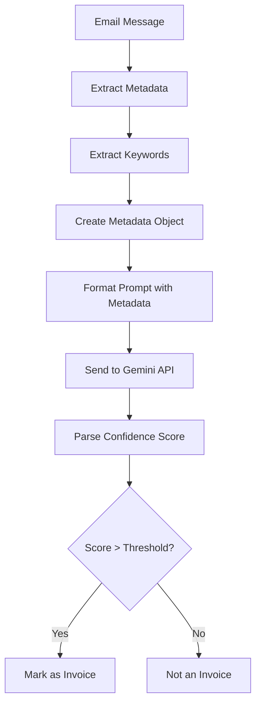
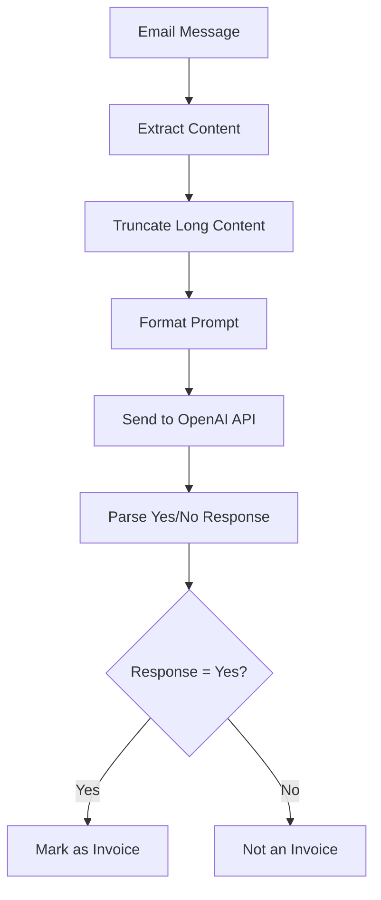

# AI Integration: Gmail Attachment Organizer

## Overview

The Gmail Attachment Organizer uses AI to enhance its invoice detection capabilities. This document explains the AI integration, focusing on the privacy considerations, implementation details, and how the system ensures consistent behavior across different AI providers.

> **IMPORTANT**: The AI-powered invoice detection is only activated when an email contains at least one PDF attachment (as defined in `CONFIG.invoiceFileTypes`). This ensures that AI processing is focused only on emails that are likely to contain invoices, reducing unnecessary API calls and minimizing data exposure.

## AI Providers

The system currently supports two AI providers:

1. **Google Gemini** (Recommended)
   - Uses the Generative Language API (generativelanguage.googleapis.com)
   - Uses the Gemini 2.0 Flash model (gemini-2.0-flash)
   - Privacy-focused implementation that only sends metadata
   - Uses pattern recognition for higher accuracy
   - Configurable confidence threshold

2. **OpenAI** (Alternative)
   - More established model with strong language understanding
   - Requires more careful content handling for privacy
   - Binary yes/no response format

## Privacy-First Approach

### Core Privacy Principles

1. **Minimal Data Exposure**
   - Only necessary information is sent to AI services
   - Full email content is never sent when using Gemini
   - Personal identifiers like email addresses are anonymized
   - Only domain names are shared, not full email addresses
   - Content is truncated when using OpenAI to minimize exposure

2. **Configurable Domain Exclusion**
   - Specific domains can be excluded from AI analysis
   - Prevents sensitive emails from being processed by external AI

3. **Local Pattern Recognition**
   - Keywords and patterns are extracted locally before sending to AI
   - Reduces the need to send full content

4. **Attachment Type Filtering**
   - Only processes emails with specific attachment types (e.g., PDFs)
   - Reduces unnecessary API calls and data exposure

5. **Historical Pattern Learning**
   - Uses previously identified invoices to improve detection
   - Reduces reliance on sending new content to AI services

## Implementation Details

### Gemini Implementation (Privacy-Focused)



The Gemini implementation:

1. Extracts only metadata from emails (subject, sender, attachment types)
2. Identifies keywords and patterns locally
3. Sends a structured metadata object to Gemini
4. Receives a confidence score (0.0-1.0)
5. Applies a configurable threshold to determine if it's an invoice

### OpenAI Implementation



The OpenAI implementation:

1. Extracts subject and body content
2. Truncates long content to minimize data exposure
3. Formats a prompt with clear instructions
4. Sends the prompt to OpenAI
5. Parses the yes/no response

### Consistent Logic Between Implementations

Both implementations follow the same core logic:

1. **Configuration Check**
   - Both check if their respective AI is enabled
   - Both respect the same domain exclusion list

2. **Error Handling**
   - Both implement comprehensive error handling
   - Both can fall back to keyword detection on failure

3. **API Key Management**
   - Both use the same approach for API key storage and retrieval
   - Both support environment variable configuration

4. **Testing Functions**
   - Both provide test functions to verify connectivity
   - Both include detailed logging for troubleshooting

## Configuration Options

The system provides several configuration options to control AI behavior:

```javascript
// AI configuration
invoiceDetection: "gemini", // AI to use: "gemini", "openai", or false to disable

// OpenAI settings
openAIApiKey: "__OPENAI_API_KEY__", // Will be replaced during build
openAIApiKeyPropertyName: "openai_api_key", // Property name to store the API key
openAIModel: "gpt-3.5-turbo", // Model to use
openAIMaxTokens: 100, // Maximum tokens for response
openAITemperature: 0.05, // Very low temperature for more conservative responses

// Gemini settings
geminiApiKey: "__GEMINI_API_KEY__", // Will be replaced during build
geminiApiKeyPropertyName: "gemini_api_key", // Property name to store the API key
geminiModel: "gemini-2.0-flash", // Model to use
geminiMaxTokens: 10, // Maximum tokens for response
geminiTemperature: 0.05, // Very low temperature for more conservative responses

// Shared AI settings
skipAIForDomains: ["newsletter.com", "marketing.com"], // Skip AI for these domains
onlyAnalyzePDFs: true, // Only send emails with PDF attachments to AI
strictPdfCheck: true, // Check both file extension and MIME type for PDFs
fallbackToKeywords: true, // Fall back to keyword detection if AI fails
aiConfidenceThreshold: 0.9, // High confidence threshold to reduce false positives
```

## Implementation Differences and Recommendations

### Current Implementation Differences

The Gemini and OpenAI implementations currently use different approaches:

1. **Gemini (Recommended Approach)**
   - Only sends metadata extracted from emails (subject, sender, attachment types)
   - Extracts keywords and patterns locally before sending to the API
   - Never sends the actual email content to the API
   - Returns a confidence score that can be adjusted with a threshold

2. **OpenAI (Legacy Approach)**
   - Sends truncated email content (subject + up to 1500 characters of body)
   - Relies on the API to analyze the content directly
   - Sends more data to the external API
   - Returns a binary yes/no response

### Security Recommendation

**For maximum privacy and security, the OpenAI implementation should be updated to match the Gemini approach:**

1. Extract metadata and keywords locally
2. Send only the structured metadata to OpenAI
3. Never send actual email content
4. Modify the prompt to request a confidence score instead of yes/no

This change would significantly improve the privacy profile of the OpenAI implementation while still leveraging its language understanding capabilities. The current implementation was created before the metadata-only approach was developed and should be updated to follow the same privacy-first pattern.

## Privacy Safeguards Comparison

| Privacy Safeguard   | Gemini Implementation | OpenAI Implementation |
| ------------------- | --------------------- | --------------------- |
| Content Exposure    | Metadata only         | Truncated content     |
| Pattern Extraction  | Local extraction      | Server-side analysis  |
| Confidence Control  | Numeric threshold     | Binary yes/no         |
| Domain Exclusion    | Supported             | Supported             |
| PDF-only Option     | Supported             | Supported             |
| Historical Learning | Supported             | Supported             |

## Integration with Main Workflow

The AI detection is integrated into the main workflow through the `isInvoiceMessage` function in GmailProcessing.gs:

1. The function first checks if AI detection is enabled
2. If enabled, it checks if the message has PDF attachments (if configured)
3. It checks if the sender domain should be skipped
4. It calls the appropriate AI detection function based on configuration
5. If AI detection fails, it can fall back to keyword detection

## Future Enhancements

Potential future enhancements to the AI integration include:

1. **Additional AI Providers**
   - Support for other AI services could be added
   - Implementation would follow the same privacy-first approach

2. **Enhanced Metadata Analysis**
   - More sophisticated local pattern recognition
   - Better historical pattern learning

3. **Confidence Level Logging**
   - Track confidence scores over time
   - Adjust thresholds based on user feedback

4. **Content Anonymization**
   - Further techniques to anonymize content before sending to AI
   - Removal of personally identifiable information

5. **User Feedback Loop**
   - Allow users to correct AI classifications
   - Use feedback to improve future detection
