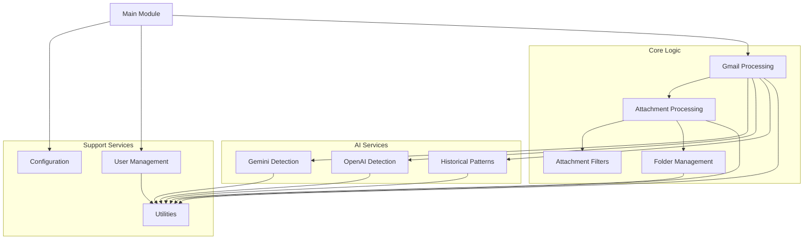
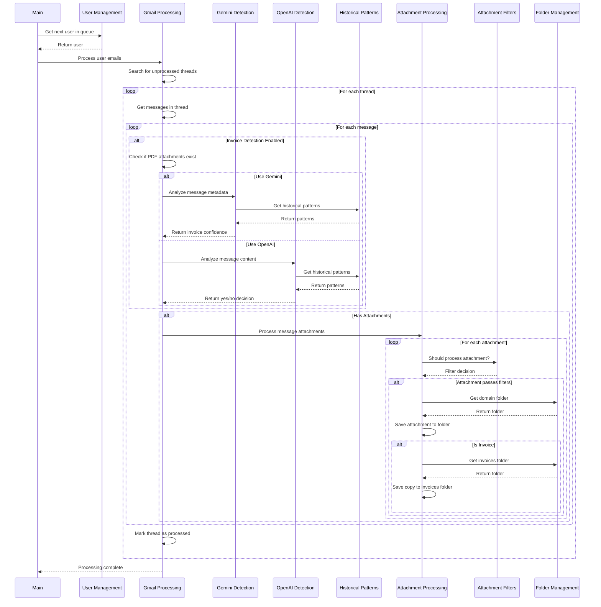

# System Patterns: Gmail Attachment Organizer

## System Architecture

The Gmail Attachment Organizer follows a modular architecture with clear separation of concerns. The system is structured around these key components:



## Key Technical Decisions

### 1. Modular Code Structure

The codebase is divided into logical modules, each with a specific responsibility. This approach enhances maintainability and allows for easier updates and extensions.

**Implementation**:

- Separate .gs files for each module
- Clear interfaces between modules
- Minimal dependencies between components

### 2. Thread-Level Processing

Emails are processed at the thread level rather than individual messages to optimize Gmail API usage and maintain conversation context.

**Implementation**:

- Threads are labeled as processed
- All messages within a thread are examined for attachments
- New messages in processed threads require manual intervention

### 3. Intelligent Attachment Filtering

A sophisticated filtering system distinguishes between real attachments and embedded content like signatures and logos.

**Implementation**:

- MIME type whitelist for important document types
- Content-disposition analysis
- HTML email image URL detection
- Filename pattern recognition
- Size-based filtering for small images

### 4. Batch Processing with Execution Lock

To prevent timeouts and concurrent execution issues, the script processes emails in batches and uses a locking mechanism.

**Implementation**:

- Configurable batch size
- Script properties-based locking mechanism
- Exponential backoff for retries

### 5. Domain-Based Organization

Attachments are organized by sender domain to create a logical folder structure.

**Implementation**:

- Domain extraction from email addresses
- Dynamic folder creation
- Skip list for unwanted domains

## Design Patterns in Use

### 1. Module Pattern

Each file encapsulates related functionality, exposing only necessary functions while keeping implementation details private.

**Example**:

```javascript
// FolderManagement.gs
function getOrCreateDomainFolder(domain) {
  // Implementation details hidden
}

// Only necessary functions are exposed for use by other modules
```

### 2. Configuration Object Pattern

A centralized configuration object contains all adjustable settings, making it easy to modify behavior without changing code.

**Example**:

```javascript
// Config.gs
const CONFIG = {
  mainFolderId: "__FOLDER_ID__",
  processedLabelName: "GDrive_Processed",
  // Other configuration options...
};
```

### 3. Retry Pattern with Exponential Backoff

Operations that might fail due to transient issues are retried with increasing delays.

**Example**:

```javascript
// Utils.gs
function withRetry(operation, maxRetries, initialDelay, maxDelay) {
  // Implementation with exponential backoff
}
```

### 4. Factory Pattern

Functions that create and return objects, such as folder creation functions.

**Example**:

```javascript
// FolderManagement.gs
function createFolder(name, parent) {
  // Creates and returns a folder object
}
```

### 5. Queue Processing Pattern

Users are processed in a queue to ensure fair distribution of resources.

**Example**:

```javascript
// UserManagement.gs
function getNextUserInQueue() {
  // Returns the next user to process
}
```

## Component Relationships

### Main Module (Main.gs)

- **Role**: Entry point and orchestration
- **Relationships**:
  - Uses UserManagement to get authorized users
  - Coordinates the overall process flow
  - Handles execution locking
  - Creates triggers for scheduled execution

### Configuration (Config.gs)

- **Role**: Central configuration store
- **Relationships**:
  - Referenced by all other modules
  - No dependencies on other modules

### User Management (UserManagement.gs)

- **Role**: Handles user authorization and queue
- **Relationships**:
  - Used by Main module
  - Uses Utils for logging and property storage

### Gmail Processing (GmailProcessing.gs)

- **Role**: Searches and processes Gmail threads
- **Relationships**:
  - Used by Main module
  - Uses AttachmentProcessing to handle attachments
  - Uses GeminiDetection and OpenAIDetection for invoice identification
  - Uses HistoricalPatterns for improved detection accuracy
  - Uses Utils for logging and error handling

### Attachment Processing (AttachmentProcessing.gs)

- **Role**: Extracts and saves attachments
- **Relationships**:
  - Used by GmailProcessing
  - Uses AttachmentFilters to determine which attachments to process
  - Uses FolderManagement to save files to appropriate locations
  - Uses Utils for logging and error handling

### Attachment Filters (AttachmentFilters.gs)

- **Role**: Determines which attachments should be processed
- **Relationships**:
  - Used by AttachmentProcessing
  - References Config for filtering rules

### Folder Management (FolderManagement.gs)

- **Role**: Creates and manages Google Drive folders
- **Relationships**:
  - Used by AttachmentProcessing
  - Uses Utils for logging and error handling

### Gemini Detection (GeminiDetection.gs)

- **Role**: Provides AI-powered invoice detection using Google Gemini
- **Relationships**:
  - Used by GmailProcessing for invoice identification
  - Uses HistoricalPatterns for improved detection accuracy
  - Uses Utils for logging and error handling

### OpenAI Detection (OpenAIDetection.gs)

- **Role**: Provides AI-powered invoice detection using OpenAI
- **Relationships**:
  - Used by GmailProcessing for invoice identification
  - Uses HistoricalPatterns for improved detection accuracy
  - Uses Utils for logging and error handling

### Historical Patterns (HistoricalPatterns.gs)

- **Role**: Analyzes historical invoice patterns to improve detection
- **Relationships**:
  - Used by GeminiDetection and OpenAIDetection
  - Uses Utils for logging and data processing

### Utilities (Utils.gs)

- **Role**: Provides common utility functions
- **Relationships**:
  - Used by all other modules
  - No dependencies on other modules

## Data Flow



## Error Handling Strategy

The system employs a multi-layered error handling approach:

1. **Function-Level Try/Catch**
   - Each function has its own error handling
   - Errors are logged with context
   - Functions fail gracefully when possible

2. **Operation-Level Retries**
   - API operations use retry logic
   - Exponential backoff prevents overwhelming services
   - Maximum retry limits prevent infinite loops

3. **Process-Level Recovery**
   - Errors in processing one item don't stop the entire batch
   - The main process continues even if individual items fail
   - Execution locks are released properly even on errors

4. **User-Level Isolation**
   - Errors for one user don't affect processing for others
   - Permission issues are handled gracefully

## Concurrency Control

To prevent issues with multiple simultaneous executions:

1. **Execution Lock**
   - Script properties are used to implement a simple locking mechanism
   - Locks have a maximum duration to prevent permanent locking
   - Lock acquisition includes timestamp for expiration calculation

2. **User Queue**
   - Users are processed in a round-robin fashion
   - Each execution processes one user from the queue
   - Ensures fair distribution of processing time

## Extension Points

The system is designed with several extension points for future enhancements:

1. **Additional AI Providers**
   - New AI detection modules can be added following the same pattern as GeminiDetection.gs and OpenAIDetection.gs
   - The invoiceDetection configuration option supports adding new providers

2. **Enhanced AI Analysis**
   - More sophisticated metadata extraction for privacy-focused analysis
   - Additional historical pattern analysis techniques
   - Content anonymization before sending to AI services

3. **Additional Attachment Filters**
   - New filtering logic can be added to AttachmentFilters.gs
   - The filtering system is designed to be extensible

4. **Alternative Organization Schemes**
   - The domain-based organization could be extended or replaced
   - FolderManagement.gs could be modified to implement different organization strategies

5. **Enhanced Metadata**
   - Additional metadata could be stored with files
   - The file description is already used for email timestamps

6. **User Preferences**
   - The system could be extended to support per-user configuration
   - UserManagement.gs could store user-specific settings
